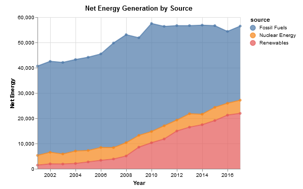
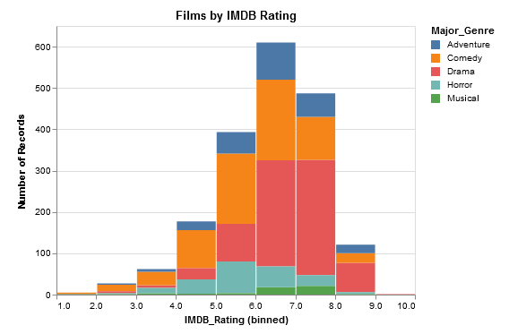
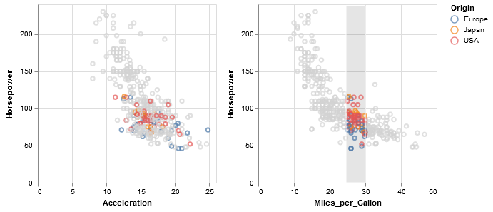
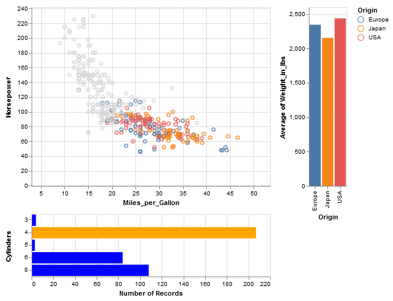
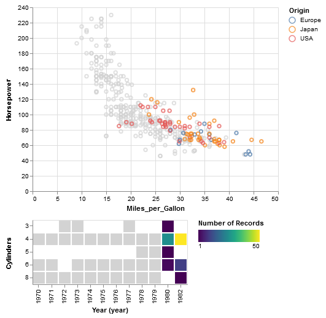

# altair-examples
An IPython notebook containing examples demonstrating the features of
<a href="https://altair-viz.github.io/">Altair</a>, a statistical
visualization library for Python.

Used for a talk I gave at the Python Piedmont Triad User Group (PYPTUG).

Title: Using the Python Library Altair for Data Visualization\
Date: October 30, 2018\
Location: Wake Forest University, Manchester Hall 241

Abstract:\
Altair, a statistical visualization Python library based on Vega-Lite,
is designed to facilitate the exploration of data by making it easy to
generate interactive web-based visualizations. Using Pandas dataframes
as data sources, Altair's API provides functionality to transform data
(bin, sort, filter, and aggregate) and produce common graphs including
histograms, line charts, scatter plots, and heatmaps. Graphs can be made
interactive with features like panning, zooming, and filtering by mouse
pointer selections. With very few lines of code, you can generate rich,
interactive, and portable web-based graphs.

## Simple Plots using VEGA Datasets

### Energy Generation
An area plot of energy production color coded by generation process.

### IMDB Ratings of Films
Stacked histogram of films binned by IMDB rating and color coded by genre.

## Concatenation and Dashboards

### Cars Produced between 1970 and 1982

1. Horizontally concatenated plots: Horsepower vs. Acceleration and
Horsepower vs. Miles per Gallon plotted side-by-side with a common
legend showing country of origin by color. In the rightmost plot,
cars with mileage between 25 mpg and 30 mpg have been selected by
a click-and-drag of the mouse(shown by gray hilighted bar).
Data in the leftmost plot is filtered by this selection, showing the
selected vehicles in color.
   

2. A simple dashboard of three plots. Selecting a bar on the 
lower horizontal bar chart of Cylinders vs. Number of Records filters the data
presented in the Avg. Weight vs. Origin vertical bar chart and the
scatter plot of Horsepower vs. Miles per Gallon. Note that on the scatter plot
the selected data is shown in color, while unselected data is grayed out. In this
case, 4-cylinder vehicles have been selected.

3. Similar to the previous dashboard, but the data is filtered with
a heatmap instead of a bar chart. In this instance, cars produced
in 1980 and 1982 have been selected.

